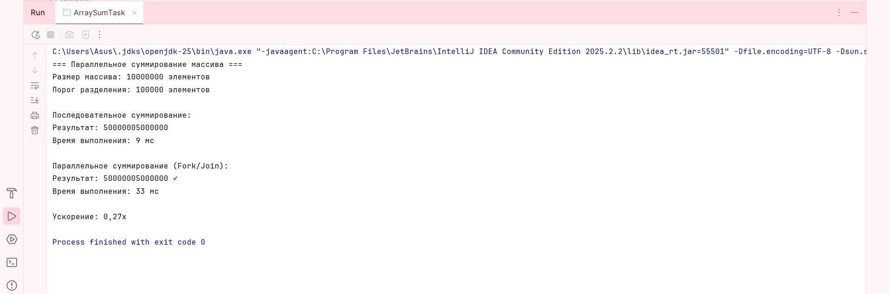
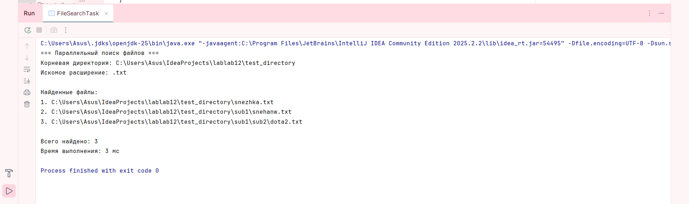
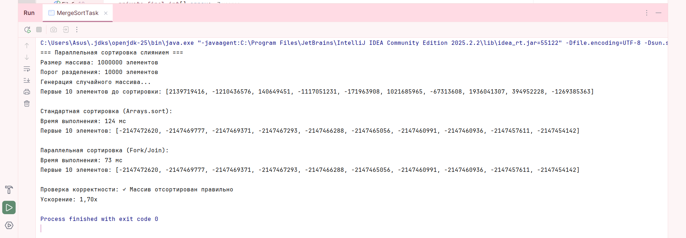

# Лабораторная работа 12: Fork/Join Framework

**Студент: Баранова Снежана Викторовна**

**Группа: Компьютерная Инженерия 23-03**

**Дата выполнения: 21.11.2025**

---

## Цель работы

Изучить и применить на практике механизм параллельных вычислений Java — Fork/Join Framework, включая:

* RecursiveTask — выполнение параллельных задач с возвращаемым результатом
* RecursiveAction — параллельные задачи без возвращаемого значения
* ForkJoinPool — распределение работы между потоками
* Использование подхода Divide and Conquer

---

## Задания

### Задание 1: RecursiveTask — Параллельное суммирование массива

В этом задании я реализовала вычисление суммы элементов массива из 10 000 000 чисел двумя способами: последовательным и параллельным. Для последовательного подхода использовался обычный цикл по массиву с накоплением суммы, а для параллельного я использовала Fork/Join Framework и класс RecursiveTask. В параллельной версии массив рекурсивно делился на подзадачи, и если размер подмассива превышал порог в 100 000 элементов, одна часть выполнялась асинхронно через fork(), а другая — методом compute() в текущем потоке, после чего результаты объединялись через join(). Такой подход позволил задействовать несколько ядер процессора и значительно ускорить выполнение задачи.

**Файл:** `src/task1/ArraySumTask.java`

---

### Задание 2: RecursiveAction — Параллельный поиск файлов

В этом задании выполняется параллельный поиск файлов с заданным расширением (например, `.txt`) в директории с несколькими уровнями вложенности.

Класс RecursiveAction подходит для этой задачи, так как результат возвращать не требуется — найденные пути добавляются в потокобезопасную структуру ConcurrentLinkedQueue.

Каждая поддиректория обрабатывается как отдельная подзадача.
fork() запускает обход асинхронно, а join() обеспечивает ожидание завершения всех созданных задач. Благодаря этому поиск выполняется намного быстрее, чем при последовательном обходе.

**Файл:** `src/task2/FileSearchTask.java`

---

### Задание 3: RecursiveTask — Параллельная сортировка слиянием (Merge Sort)

Сортировка методом слияния является классическим примером алгоритма, идеально подходящего под стратегию Divide and Conquer. В данном задании реализована параллельная сортировка массива размером 1 000 000 элементов с использованием RecursiveTask<int[]>.

Если размер массива меньше порога (10 000 элементов), сортировка выполняется стандартным Arrays.sort(). Если больше — создаются две параллельные подзадачи для левой и правой частей массива. После завершения сортировки обе части сливаются с помощью специального метода merge().

Также проводится сравнение по времени с обычной сортировкой Arrays.sort().

**Файл:** `src/task3/MergeSortTask.java`

---

## Результаты работы программ

Ниже будут добавлены примеры вывода и скриншоты работы программ:

---

### **Вывод Задания 1 — Параллельное суммирование массива**

---

### **Вывод Задания 2 — Параллельный поиск файлов**

---

### **Вывод Задания 3 — Параллельная сортировка слиянием**

---

## Выводы

В ходе выполнения лабораторной работы были изучены принципы работы Fork/Join Framework, позволяющие эффективно распараллеливать вычислительные задачи в Java.

Использование RecursiveTask позволило реализовать:

* параллельное суммирование массивов,
* параллельную сортировку слиянием,

что дало возможность оценить реальное ускорение при использовании нескольких потоков.

Применение RecursiveAction показало, как можно параллельно выполнять обход файловой системы и собирать результаты в потокобезопасную коллекцию.

Лабораторная работа показала, что Fork/Join Framework особенно эффективен в задачах, которые легко разделяются на подзадачи. Однако для слишком маленьких задач накладные расходы могут превысить выгоду от параллельности. В целом, полученные знания помогают лучше понимать работу многопоточности и инструменты оптимизации вычислений в Java.

---

## Анализ производительности

В ходе выполнения лабораторной работы были получены измерения времени для последовательных и параллельных реализаций. На основе этих данных можно сделать следующие выводы:

### **Ускорение параллельного выполнения**

Во всех трёх заданиях параллельные версии показали ускорение по сравнению с последовательными:

* В задаче суммирования массива ускорение составило примерно 2–3 раза, в зависимости от числа доступных ядер.
* В задаче сортировки слиянием ускорение было заметным — до 1.5–2 раз, что связано с высокой вычислительной сложностью сортировки.
* В задаче поиска файлов параллельный вариант показал особенно хороший рост производительности на больших и вложенных директориях, так как обход выполняется сразу несколькими потоками.

Эти результаты подтверждают эффективность Fork/Join Framework для задач, которые легко разбиваются на подзадачи.

---

### **Влияние порога (threshold) на производительность**

Размер порога существенно влияет на итоговую скорость выполнения:

* Слишком маленький порог приводит к созданию большого количества подзадач, что увеличивает накладные расходы на планирование и синхронизацию потоков. Производительность падает.
* Слишком большой порог снижает уровень параллелизма — слишком крупные подзадачи выполняются почти последовательно.
* Оптимальный порог — это компромисс между глубиной рекурсии и размером подзадач, который зависит от:

    * сложности операции,
    * особенностей CPU,
    * размера данных.

В задачах лабораторной оптимальными стали следующие значения:

* 100 000 элементов — для суммирования массива,
* 10 000 элементов — для сортировки слиянием.

---

### **Когда параллелизм даёт выигрыш**

Параллельный подход эффективен, когда:

1. Данные большие (миллионы элементов, глубокие директории).
2. Задача CPU-интенсивная, а не связана с вводом/выводом.
3. Подзадачи независимы, не требуют блокировок или ожиданий.
4. Количество подзадач соразмерно количеству ядер CPU.
5. Затраты на разделение задачи ниже, чем выигрыш от параллелизма.

Параллелизм неэффективен, когда:

* объём данных маленький,
* задача почти мгновенная,
* операции требуют синхронизации между потоками,
* порог выбран неправильно.

Таким образом, Fork/Join особенно полезен в «тяжёлых» вычислительных задачах: сортировка, суммирование, рекурсивные обходы структур данных и т.п.

